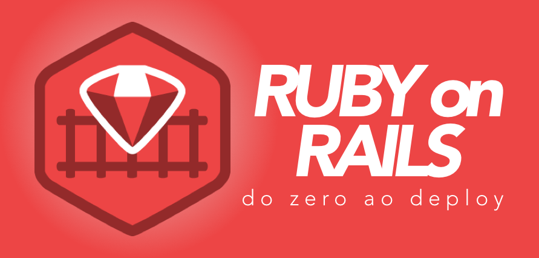

[//]: # (Title:	Ruby on Rails: do zero ao deploy - 01)
[//]: # (Author:	Prof. Dr. Alexander Robert Kutzke)
[//]: # (Date:		06/02/2017)



[<< Voltar](index.html)

# Material da aula 01

## Temas abordados:

* Apresentação;
* Ruby:
	* História;
	* Características;
	* Loops, blocks, hashs e symbols;
* Rails;
	* Comentários sobre o Rack;
	* Funcionalidades e funcionamento básico;
* Preparação do Ambiente com RVM.

## Links interessantes:

* [Site oficial do Ruby](https://www.ruby-lang.org/pt/)
* [Ruby em 100 exemplos](https://github.com/everaldo/ruby-em-100-exemplos)
* [Ruby loops](https://www.tutorialspoint.com/ruby/ruby_loops.htm)
* [Ruby Explained: Blocks, Procs, and Lambdas, aka "Closures"](http://www.eriktrautman.com/posts/ruby-explained-blocks-procs-and-lambdas-aka-closures)
* [Ruby Hashes](http://rubylearning.com/satishtalim/ruby_hashes.html)
* [Rails guides](http://guides.rubyonrails.org/)
* [What is Rack in Ruby?](https://medium.com/@christemple/what-is-rack-in-ruby-7e0615f1d9b6#.9t4c9wlvb)
* [Stackoverflow](http://stackoverflow.com/)
* [Rails Casts](http://railscasts.com/)
* [Ruby Version Manager (RVM)](http://rvm.io/)

## Comandos para preparação do Ambiente

### Criando uma máquina virtual vagrant

(Ver [página principal](index.html) para mais informações sobre a preparação da máquina virtual com vagrant).

```bash
	# Acessar a pasta em que a máquina virtual vagrant está configura
	# ~/vagrant/precise32 talvez??
	vagrant up
	vagrant ssh

	sudo apt-get update -y
	sudo apt-get install -y curl git

	# Chave para RVM -- http://rvm.io
	gpg --keyserver hkp://keys.gnupg.net --recv-keys 409B6B1796C275462A1703113804BB82D39DC0E3
	\curl -sSL https://get.rvm.io | bash -s stable

	# Fechar ssh e abrir novamente

	rvm list known
	rvm install 2.3

	# Rails
	gem install bundle
	gem install rails

	# Testar servidor
	cd /vagrant
	rails new blog
	cd blog

	# Descomentar linha 22 (TheRubyRacer) no arquivo Gemfile
	bundle install
	rails server

	# Em outro terminal
	cd vagrant ...
	vagrant ssh
	sudo apt-get install -y w3m
	w3m http://localhost:3000

	# Para habilitar o port forward
	vagrant halt
	# Alterar a linha 25 do arquivo Vagrantfile (config.vm.network "forwarded_port", guest: 3000, host: 3000)
	vagrant up
	vagrant ssh

	cd /vagrant/blog
	rails s -b 0.0.0.0

	# Teste do scaffold
	rails generate scaffold article title:string content:text
	rake db:migrate
```

### Problemas para executar o servidor Rails com Vagrant no Windows

Para utilizar o servidor da sua aplicação rails utilzando Vagrant no sistema operacional Windows execute o seguinte:

```bash
	# entre na máquina virtual pelo vagrant
	vagrant up
	vagrant ssh

	# Dentro da máquina virtual ...
	# Descubra o ip da máquina:
	ifconfig
```

A saída será algo como segue:

```bash
	eth0    Link encap:Ethernet  HWaddr 08:00:27:12:96:98  
          inet addr:10.0.2.15  Bcast:10.0.2.255  Mask:255.255.255.0
          inet6 addr: fe80::a00:27ff:fe12:9698/64 Scope:Link
          UP BROADCAST RUNNING MULTICAST  MTU:1500  Metric:1
          RX packets:292 errors:0 dropped:0 overruns:0 frame:0
          TX packets:227 errors:0 dropped:0 overruns:0 carrier:0
          collisions:0 txqueuelen:1000
          RX bytes:32807 (32.8 KB)  TX bytes:27466 (27.4 KB)

	lo      Link encap:Local Loopback  
          inet addr:127.0.0.1  Mask:255.0.0.0
          inet6 addr: ::1/128 Scope:Host
          UP LOOPBACK RUNNING  MTU:16436  Metric:1
          RX packets:0 errors:0 dropped:0 overruns:0 frame:0
          TX packets:0 errors:0 dropped:0 overruns:0 carrier:0
          collisions:0 txqueuelen:0
          RX bytes:0 (0.0 B)  TX bytes:0 (0.0 B)
```

Na segunda linha, note o ip da máquina virtual: *addr:10.0.2.15*.

Agora, basta iniciar o servidor Rails com bind nesse ip:

```bash
	# acessar a pasta do projeto rails
	cd /vagrant/blog

	rails server -b 10.0.2.15 # ou o IP que apareceu na sua maquina
```

Feito isso, basta abrir qualquer navegar no ambiente nativo Windows e acessar o endereço http://127.0.0.1:3000 .

Lembre-se de fazer o port forward no arquivo Vagrantfile (ver comandos acima).
